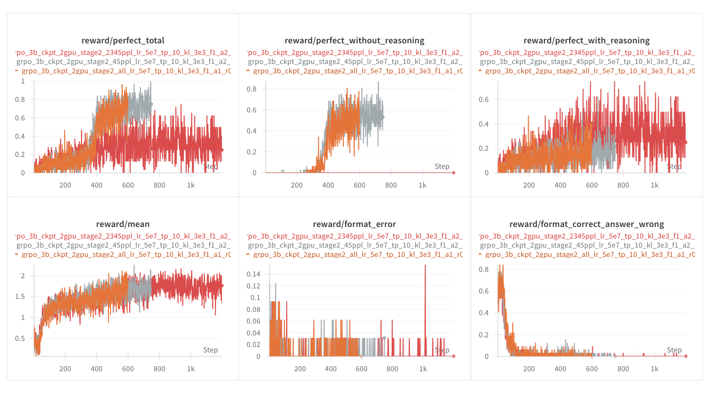
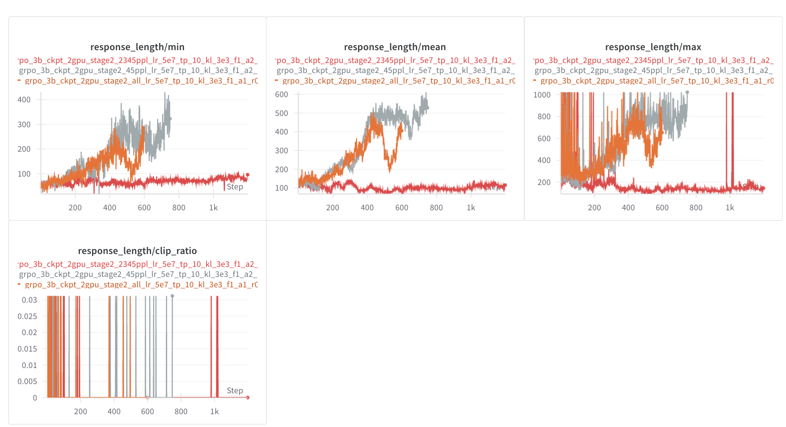

# GRPO_KKLogic

## Project Introduction
This project explores the training of a 3B-parameter model on 3,000 logic puzzles from the Knights and Knaves dataset. The training process is divided into two stages:

### Stage 1: Format Compliance
In this stage, the model is trained to adhere to the required output format. A reward function emphasizing format correctness ensures that the model produces structured and consistent responses.

### Stage 2: Logical Reasoning Enhancement
Building on the structured outputs from Stage 1, the model is further trained to improve its logical reasoning capabilities. A refined reward function prioritizes accurate reasoning and correct answers while maintaining format consistency.

Through this staged approach, the 3B-parameter model achieves performance surpassing `GPT-4o` on the Knights and Knaves logic puzzles. This project is inspired by the RL_Logic project but introduces a novel reward function tailored to enhance both format adherence and reasoning accuracy.

Stay tuned for our detailed technical report!

See [project explanation](#) for more details.  
Wandb project: [GRPO_KKLogic Report](https://wandb.ai/qqliao_shu_feng-brainfussion/RL_FULL_EXPERIMENT_V2/reports/GRPO_KKLogic_Sample_3000VS6000--VmlldzoxMTgxNzQxMQ)

---

## 📸 Results Preview

<table>
  <tr>
    <td align="center"></td>
    <td align="center"></td>
  </tr>
  <tr>
    <td align="center">Reward Plot</td>
    <td align="center">Average Output Length Plot</td>
  </tr>
</table>

---

### Before
The initial output demonstrates the model's raw attempt at solving the puzzle, with minimal adherence to logical reasoning or format consistency.

```bash
<think> First, let's analyze the statements made by Ethan, Mia, and Emily. Ethan claims that Emily is a knight and Mia is a knight. Mia claims that Emily is not a knave. Emily claims that Mia is a knave if and only if Emily is a knight. </think> <answer> (1) Ethan is a knight (2) Mia is a knave (3) Emily is a knight  </answer>
```


### After
After training, the model produces structured and logically consistent responses, as shown below.


```bash
<think>First, let's analyze each statement based on whether the speaker is a knight (truth-teller) or a knave (liar):
 1. Zoey says: "If Ava is a knight then Scarlett is a knight."
    - This can be written as P → Q where P represents "Ava is a knight" and Q represents "Scarlett is a knight".
    - A knight would say this if both P and Q were true, while a knave would say this if P were true and Q were false (or both false).
 2. Matthew says: "If Michael is a knave then Scarlett is a knight."
    - This can be written as ~P → Q where ~P represents "Michael is a knave" and Q represents "Scarlett is a knight".
    - A knight would say this if either P were true and Q were false, or both false. A knave would say this if P were false and Q were true.
 3. Ava says: "Michael is a knight and Zoey is a knight."
    - This means both P (Michael is a knight) and Q (Zoey is a knight) must be true for Ava to be telling the truth.
 4. Michael says: "Scarlett is a knave or Matthew is a knight."
    - This can be written as ~Q ∨ R where ~Q represents "Scarlett is a knave" and R represents "Matthew is a knight".
    - A knight would say this if either ~Q were true (Scarlett is a knave) or R were true (Matthew is a knight). A knave would say this if both ~Q and R were false.
 5. Scarlett says: "Scarlett is a knight."
    - For Scarlett to be telling the truth, she must indeed be a knight.
 Now, let's consider the implications of each possibility:
 - If Zoey is a knight, then her statement "If Ava is a knight then Scarlett is a knight" must be true. Since Ava claims both Michael and Zoey are knights, if Zoey is a knight, then Scarlett must also be a knight.
 - If Matthew is a knight, then his statement "If Michael is a knave then Scarlett is a knight" must be true. Since Michael claims either Scarlett is a knave or Matthew is a knight, if Matthew is a knight, then Scarlett must be a knight.
 - If Ava is a knight, then both Michael and Zoey are knights. From Zoey's statement, since Scarlett is a knight, her part of the implication is satisfied.
 - If Michael is a knight, then either Scarlett is a knave or Matthew is a knight. Since Matthew is a knight, this condition is met.
 - If Scarlett is a knight, her statement is true.
 By combining these conditions, we find that if Zoey, Matthew, and Scarlett are knights, then Ava must also be a knight to satisfy her own claim. Finally, Michael being a knight ensures that his original statement holds true. Therefore, all five individuals are knights.</think>
 <answer> (1) Zoey is a knight
 (2) Matthew is a knight
 (3) Ava is a knight
 (4) Michael is a knight
 (5) Scarlett is a knight </answer>
```

---

## 🛠️ Installation

```bash
conda create -n logic python=3.9
pip install torch==2.4.0 --index-url https://download.pytorch.org/whl/cu121
pip3 install vllm==0.6.3 ray
pip3 install flash-attn --no-build-isolation
pip install -e .  # For verl integration
pip install wandb IPython matplotlib
```

---

## Data Preparation
```bash
python ./data_gen.py
```

## Update args
Update your information in `train.sh`first.


### Model Trainning
```bash
bash train.sh
```
---
